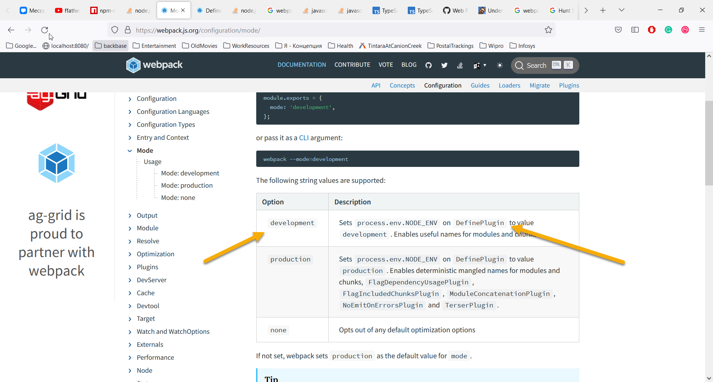

# this project's purpose is to reproduce issue I am having in another project.
- **What I expect?** - I expect that after I execute `npm run watch` command - the generated
`result/bundle.js` file to have such lines:

```
...
var _environment = 'development';
var _ANOTHER_VARIABLE = "another variable value";
...
```
- **What is actual result?** - after I execute `npm run watch` command - the generated
  `result/bundle.js` file contains such lines:

```
...
var _environment = undefined;
var _ANOTHER_VARIABLE = "another variable value";
...
```

- **Why do I have such expectations?** - because of these lines:

```
...
  plugins: [
        new webpack.DefinePlugin({
            ENVIRONMENT: JSON.stringify(process.env.NODE_ENV),
            ANOTHER_VARIABLE: JSON.stringify("another variable value"),
        })
    ]
...
```
in `webpack.config.js` file.

As you can see variable `_environment` is not initialized with `development` value as it is promised 
here: https://webpack.js.org/configuration/mode/
